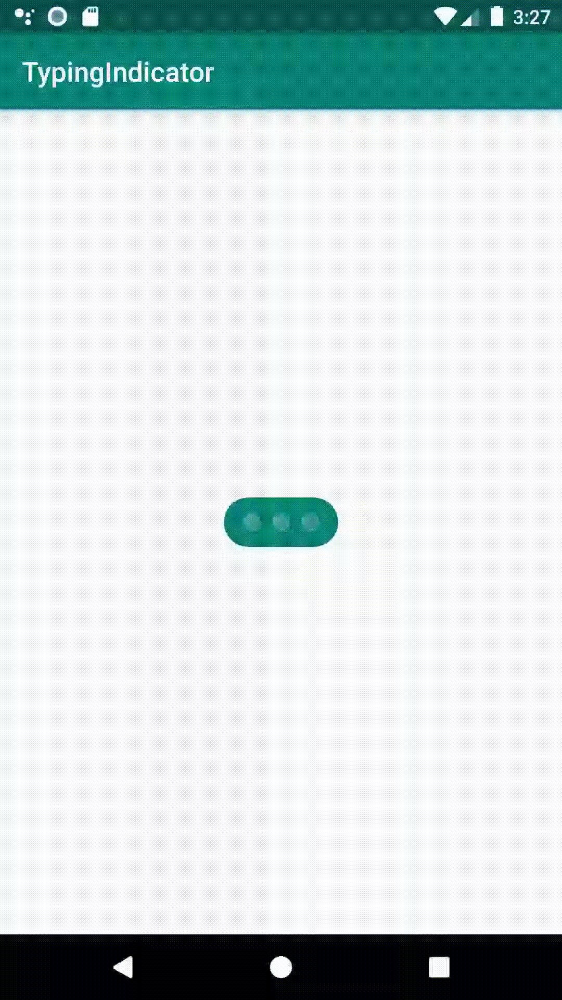

# TypingIndicator

This is an android library to help developer showing a pending status in instant messaging applications.

## Import library

```groovy
implementation 'com.qifan.typingIndicator:typingIndicator:0.1.0'
```

## ScreenShots

 

## Example Usage

```xml
  <com.qifan.library.ChatTypingIndicatorView
            android:layout_width="wrap_content"
            android:layout_height="wrap_content"
            android:minHeight="36dp"
            android:padding="10dp"
            android:background="@drawable/message_background"
            app:dotSize="10dp"
            app:layout_constraintBottom_toBottomOf="parent"
            app:layout_constraintLeft_toLeftOf="parent"
            app:layout_constraintRight_toRightOf="parent"
            app:layout_constraintTop_toTopOf="parent"/>
```

## Custom Properties

| Property  | Type  | Description  |
|---|---|---|
|  dotSize |  dimension |  Control indicator size |
|  dotCount |  integer |  number of indicators |
|  dotColor |  color |  color of active indicator |
|  dotSecondColor |  color |  color of inactive indicator |
|  dotHorizontalSpacing |dimension | padding dimensions of each indicator |
|  dotAnimationDuration | integer | indicator animation duration |
|  backgroundColor | color | background of layout  |
|  animateFrequency | integer | delayed time of indicator animation |


